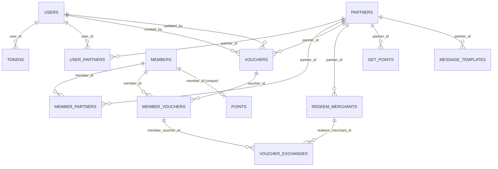

# ERD Core Loyalty System

Dokumen ini disusun dari seluruh file migration pada folder `database/migrations` (urut timestamp paling awal sampai paling akhir).

## 1) Diagram Relasi (FK Eksplisit)

## 2) Relasi Implikasi Nama Field (Tanpa FK di Migration)

- `point_histories.member_id` mengarah ke `members.member_id`.
- `point_histories.partner_id` mengarah ke `partners.partner_id`.
- `members.default_partner_id` mengarah ke `partners.partner_id`.
- `carts.member_id` mengarah ke `members.member_id`.
- `carts.partner_id` mengarah ke `partners.partner_id`.
- `addresses.member_id` mengarah ke `members.member_id`.
- `transactions.member_id` mengarah ke `members.member_id`.
- `product_reviews.member_id` mengarah ke `members.member_id` (nullable).

## 3) Data Dictionary

Keterangan ringkas:
- `timestamps()` pada migration berarti ada kolom `created_at` dan `updated_at`.
- Nilai `Null` di bawah mengikuti ada/tidaknya `.notNullable()` pada migration.

### `users`

| Field | Type | Null | Key/Constraint | Default | Reference |
| --- | --- | --- | --- | --- | --- |
| `user_id` | `increments` | No | PK | auto increment | - |
| `phone` | `string(25)` | Yes | - | - | - |
| `email` | `string(254)` | No | UNIQUE | - | - |
| `firstname` | `string(80)` | No | - | - | - |
| `lastname` | `string(80)` | No | - | - | - |
| `password` | `string(60)` | Yes | - | - | - |
| `image_profile` | `string` | Yes | - | - | - |
| `type` | `enum('partner','admin')` | Yes | - | `partner` | - |
| `status` | `enum('active','not active','suspend')` | Yes | - | `not active` | - |
| `token` | `string` | Yes | - | - | - |
| `is_owner` | `enum('yes','no')` | Yes | - | `yes` | - |
| `created_at` | `timestamp` | Yes | from `timestamps()` | - | - |
| `updated_at` | `timestamp` | Yes | from `timestamps()` | - | - |
| `deleted_at` | `datetime` | Yes | - | - | - |

### `tokens`

| Field | Type | Null | Key/Constraint | Default | Reference |
| --- | --- | --- | --- | --- | --- |
| `token_id` | `increments` | No | PK | auto increment | - |
| `user_id` | `integer unsigned` | Yes | FK | - | `users.user_id` |
| `token` | `string(255)` | No | UNIQUE, INDEX | - | - |
| `type` | `string(80)` | No | - | - | - |
| `is_revoked` | `boolean` | Yes | - | `false` | - |
| `created_at` | `timestamp` | Yes | from `timestamps()` | - | - |
| `updated_at` | `timestamp` | Yes | from `timestamps()` | - | - |

### `members`

| Field | Type | Null | Key/Constraint | Default | Reference |
| --- | --- | --- | --- | --- | --- |
| `member_id` | `increments` | No | PK | auto increment | - |
| `lid` | `string` | Yes | - | - | - |
| `phone` | `string(25)` | Yes | UNIQUE | - | - |
| `email` | `string(254)` | Yes | UNIQUE | - | - |
| `verified_email` | `enum('0','1')` | Yes | - | `0` | - |
| `password` | `string(60)` | Yes | - | - | - |
| `firstname` | `string(80)` | Yes | - | - | - |
| `lastname` | `string(80)` | Yes | - | - | - |
| `token` | `string(80)` | Yes | - | - | - |
| `token_valid_until` | `datetime` | Yes | - | - | - |
| `image_profile` | `string` | Yes | - | - | - |
| `status` | `enum('active','not active','suspend')` | Yes | - | `not active` | - |
| `default_partner_id` | `integer unsigned` | Yes | - | - | - |
| `created_at` | `timestamp` | Yes | from `timestamps()` | - | - |
| `updated_at` | `timestamp` | Yes | from `timestamps()` | - | - |
| `deleted_at` | `datetime` | Yes | - | - | - |

### `partners`

| Field | Type | Null | Key/Constraint | Default | Reference |
| --- | --- | --- | --- | --- | --- |
| `partner_id` | `increments` | No | PK | auto increment | - |
| `name` | `string` | Yes | UNIQUE | - | - |
| `client_id` | `string` | Yes | - | - | - |
| `server_id` | `string` | Yes | - | - | - |
| `logo` | `string` | Yes | - | - | - |
| `desc` | `text` | Yes | - | - | - |
| `howtogetpoint` | `text` | Yes | - | - | - |
| `store_slug` | `string` | Yes | - | - | - |
| `company_slug` | `string` | Yes | - | - | - |
| `primary_color` | `string` | Yes | - | - | - |
| `created_at` | `timestamp` | Yes | from `timestamps()` | - | - |
| `updated_at` | `timestamp` | Yes | from `timestamps()` | - | - |
| `deleted_at` | `datetime` | Yes | - | - | - |

### `user_partners`

| Field | Type | Null | Key/Constraint | Default | Reference |
| --- | --- | --- | --- | --- | --- |
| `user_partner_id` | `increments` | No | PK | auto increment | - |
| `user_id` | `integer unsigned` | No | FK | - | `users.user_id` |
| `partner_id` | `integer unsigned` | No | FK | - | `partners.partner_id` |
| `created_at` | `timestamp` | Yes | from `timestamps()` | - | - |
| `updated_at` | `timestamp` | Yes | from `timestamps()` | - | - |
| `deleted_at` | `datetime` | Yes | - | - | - |
| `(user_id, partner_id)` | `composite` | - | UNIQUE | - | - |

### `member_partners`

| Field | Type | Null | Key/Constraint | Default | Reference |
| --- | --- | --- | --- | --- | --- |
| `member_partner_id` | `increments` | No | PK | auto increment | - |
| `member_id` | `integer unsigned` | No | FK | - | `members.member_id` |
| `partner_id` | `integer unsigned` | No | FK | - | `partners.partner_id` |
| `created_at` | `timestamp` | Yes | from `timestamps()` | - | - |
| `updated_at` | `timestamp` | Yes | from `timestamps()` | - | - |
| `deleted_at` | `datetime` | Yes | - | - | - |
| `(partner_id, member_id)` | `composite` | - | UNIQUE | - | - |

### `point_histories`

| Field | Type | Null | Key/Constraint | Default | Reference |
| --- | --- | --- | --- | --- | --- |
| `point_history_id` | `increments` | No | PK | auto increment | - |
| `member_id` | `integer` | Yes | - | - | - |
| `ref_id` | `string` | Yes | - | - | - |
| `desc` | `string` | Yes | - | - | - |
| `point` | `decimal(12,2)` | No | - | - | - |
| `partner_id` | `integer unsigned` | Yes | - | - | - |
| `created_at` | `timestamp` | Yes | from `timestamps()` | - | - |
| `updated_at` | `timestamp` | Yes | from `timestamps()` | - | - |
| `deleted_at` | `datetime` | Yes | - | - | - |

### `vouchers`

| Field | Type | Null | Key/Constraint | Default | Reference |
| --- | --- | --- | --- | --- | --- |
| `voucher_id` | `increments` | No | PK | auto increment | - |
| `name` | `string` | Yes | - | - | - |
| `partner_id` | `integer unsigned` | No | FK | - | `partners.partner_id` |
| `sku` | `string` | No | - | - | - |
| `product_image` | `string` | No | - | - | - |
| `voucher_image` | `string` | Yes | - | - | - |
| `number_point` | `decimal(12,2) unsigned` | No | - | - | - |
| `type` | `enum('free','amount')` | Yes | - | `free` | - |
| `status` | `enum('active','not active')` | No | - | `not active` | - |
| `description` | `text` | Yes | - | - | - |
| `duration` | `integer unsigned` | No | - | `7` | - |
| `created_by` | `integer unsigned` | No | FK | - | `users.user_id` |
| `updated_by` | `integer unsigned` | No | FK | - | `users.user_id` |
| `created_at` | `timestamp` | Yes | from `timestamps()` | - | - |
| `updated_at` | `timestamp` | Yes | from `timestamps()` | - | - |
| `deleted_at` | `datetime` | Yes | - | - | - |

### `member_vouchers`

| Field | Type | Null | Key/Constraint | Default | Reference |
| --- | --- | --- | --- | --- | --- |
| `member_voucher_id` | `increments` | No | PK | auto increment | - |
| `member_id` | `integer unsigned` | No | FK | - | `members.member_id` |
| `voucher_id` | `integer unsigned` | No | FK | - | `vouchers.voucher_id` |
| `voucher_code` | `string` | No | UNIQUE | - | - |
| `used` | `enum('0','1')` | No | - | `0` | - |
| `amount` | `decimal(12,2) unsigned` | Yes | - | - | - |
| `expire_date` | `datetime` | Yes | - | - | - |
| `created_at` | `timestamp` | Yes | from `timestamps()` | - | - |
| `updated_at` | `timestamp` | Yes | from `timestamps()` | - | - |
| `deleted_at` | `datetime` | Yes | - | - | - |

### `redeem_merchants`

| Field | Type | Null | Key/Constraint | Default | Reference |
| --- | --- | --- | --- | --- | --- |
| `redeem_merchant_id` | `increments` | No | PK | auto increment | - |
| `partner_id` | `integer unsigned` | No | FK | - | `partners.partner_id` |
| `name` | `string` | No | - | - | - |
| `address` | `text` | Yes | - | - | - |
| `lat` | `string` | Yes | - | - | - |
| `long` | `string` | Yes | - | - | - |
| `phone` | `string` | Yes | - | - | - |
| `image` | `string` | Yes | - | - | - |
| `store_id` | `string` | Yes | - | - | - |
| `created_at` | `timestamp` | Yes | from `timestamps()` | - | - |
| `updated_at` | `timestamp` | Yes | from `timestamps()` | - | - |
| `deleted_at` | `datetime` | Yes | - | - | - |
| `(store_id, partner_id)` | `composite` | - | UNIQUE | - | - |

### `points`

| Field | Type | Null | Key/Constraint | Default | Reference |
| --- | --- | --- | --- | --- | --- |
| `point_id` | `increments` | No | PK | auto increment | - |
| `member_id` | `integer unsigned` | No | UNIQUE, FK | - | `members.member_id` |
| `point` | `decimal(12,2) unsigned` | Yes | - | `0` | - |
| `status` | `enum('active','suspend')` | No | - | `active` | - |
| `created_at` | `timestamp` | Yes | from `timestamps()` | - | - |
| `updated_at` | `timestamp` | Yes | from `timestamps()` | - | - |
| `deleted_at` | `datetime` | Yes | - | - | - |

### `get_points`

| Field | Type | Null | Key/Constraint | Default | Reference |
| --- | --- | --- | --- | --- | --- |
| `get_point_id` | `increments` | No | PK | auto increment | - |
| `partner_id` | `integer unsigned` | No | FK | - | `partners.partner_id` |
| `name` | `string` | No | - | - | - |
| `code` | `string` | No | - | - | - |
| `desc` | `string` | No | - | - | - |
| `point_receive` | `decimal(12,2)` | Yes | - | - | - |
| `created_at` | `timestamp` | Yes | from `timestamps()` | - | - |
| `updated_at` | `timestamp` | Yes | from `timestamps()` | - | - |
| `deleted_at` | `datetime` | Yes | - | - | - |
| `(partner_id, code)` | `composite` | - | UNIQUE | - | - |

### `voucher_partners`

| Field | Type | Null | Key/Constraint | Default | Reference |
| --- | --- | --- | --- | --- | --- |
| `voucher_partner_id` | `increments` | No | PK | auto increment | - |
| `created_at` | `timestamp` | Yes | from `timestamps()` | - | - |
| `updated_at` | `timestamp` | Yes | from `timestamps()` | - | - |

### `message_templates`

| Field | Type | Null | Key/Constraint | Default | Reference |
| --- | --- | --- | --- | --- | --- |
| `message_template_id` | `increments` | No | PK | auto increment | - |
| `name` | `string` | Yes | - | - | - |
| `partner_id` | `integer unsigned` | No | FK | - | `partners.partner_id` |
| `template` | `text` | Yes | - | - | - |
| `status` | `enum('active','not active')` | Yes | - | - | - |
| `created_at` | `timestamp` | Yes | from `timestamps()` | - | - |
| `updated_at` | `timestamp` | Yes | from `timestamps()` | - | - |
| `deleted_at` | `datetime` | Yes | - | - | - |

### `voucher_exchanges`

| Field | Type | Null | Key/Constraint | Default | Reference |
| --- | --- | --- | --- | --- | --- |
| `voucher_exchange_id` | `increments` | No | PK | auto increment | - |
| `reff` | `string` | Yes | UNIQUE | - | - |
| `member_voucher_id` | `integer unsigned` | No | FK | - | `member_vouchers.member_voucher_id` |
| `redeem_merchant_id` | `integer unsigned` | No | FK | - | `redeem_merchants.redeem_merchant_id` |
| `note` | `string` | Yes | - | - | - |
| `created_at` | `timestamp` | Yes | from `timestamps()` | - | - |
| `updated_at` | `timestamp` | Yes | from `timestamps()` | - | - |
| `(member_voucher_id, redeem_merchant_id)` | `composite` | - | UNIQUE | - | - |

### `carts`

| Field | Type | Null | Key/Constraint | Default | Reference |
| --- | --- | --- | --- | --- | --- |
| `cart_id` | `increments` | No | PK | auto increment | - |
| `member_id` | `integer unsigned` | No | - | - | - |
| `item_id` | `integer unsigned` | No | - | - | - |
| `item_name` | `string` | No | - | - | - |
| `quantity` | `integer unsigned` | No | - | `defaultTo()` tanpa nilai | - |
| `note` | `text` | Yes | - | - | - |
| `item_image` | `string` | Yes | - | - | - |
| `menu_slug` | `string` | Yes | - | - | - |
| `checked` | `enum('0','1')` | Yes | - | `0` | - |
| `partner_id` | `integer unsigned` | Yes | - | - | - |
| `store_slug` | `string` | Yes | INDEX | - | - |
| `store_name` | `string` | Yes | - | - | - |
| `created_at` | `timestamp` | Yes | from `timestamps()` | - | - |
| `updated_at` | `timestamp` | Yes | from `timestamps()` | - | - |

### `addresses`

| Field | Type | Null | Key/Constraint | Default | Reference |
| --- | --- | --- | --- | --- | --- |
| `address_id` | `increments` | No | PK | auto increment | - |
| `member_id` | `integer unsigned` | No | - | - | - |
| `address_name` | `string` | No | - | - | - |
| `full_address` | `text` | No | - | - | - |
| `coordinate` | `string` | Yes | - | - | format `latitude,longitude` |
| `address_default` | `enum('0','1')` | Yes | - | `0` | - |
| `created_at` | `timestamp` | Yes | from `timestamps()` | - | - |
| `updated_at` | `timestamp` | Yes | from `timestamps()` | - | - |

### `transactions`

| Field | Type | Null | Key/Constraint | Default | Reference |
| --- | --- | --- | --- | --- | --- |
| `transaction_id` | `increments` | No | PK | auto increment | - |
| `member_id` | `integer unsigned` | No | - | - | - |
| `request` | `longtext` | Yes | - | - | - |
| `url` | `string` | Yes | - | - | - |
| `response` | `longtext` | Yes | - | - | - |
| `created_at` | `timestamp` | Yes | from `timestamps()` | - | - |
| `updated_at` | `timestamp` | Yes | from `timestamps()` | - | - |

### `product_reviews`

| Field | Type | Null | Key/Constraint | Default | Reference |
| --- | --- | --- | --- | --- | --- |
| `review_id` | `increments` | No | PK | auto increment | - |
| `item_id` | `integer unsigned` | No | INDEX | - | - |
| `member_id` | `integer unsigned` | Yes | INDEX | - | - |
| `rating` | `integer unsigned` | No | - | - | - |
| `comment` | `text` | Yes | - | - | - |
| `created_at` | `timestamp` | Yes | from `timestamps()` | - | - |
| `updated_at` | `timestamp` | Yes | from `timestamps()` | - | - |

## 4) Catatan Validasi Migration

- Pada migration `1724899392205_cart_schema.js`, field `quantity` menggunakan `.defaultTo()` tanpa nilai.
- Jika migration ini dijalankan apa adanya, perilaku default `quantity` bergantung pada SQL yang dihasilkan Knex/driver DB.
